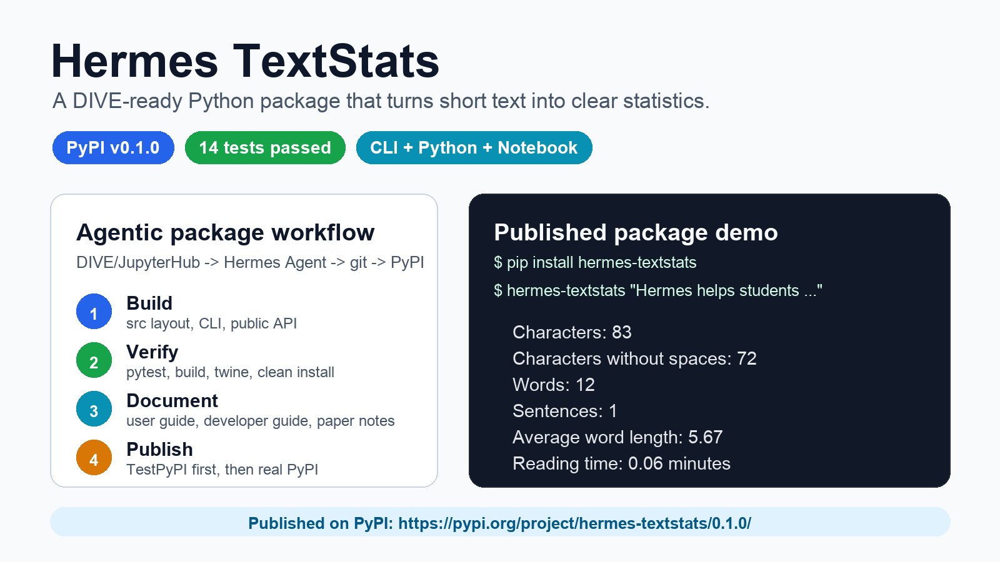
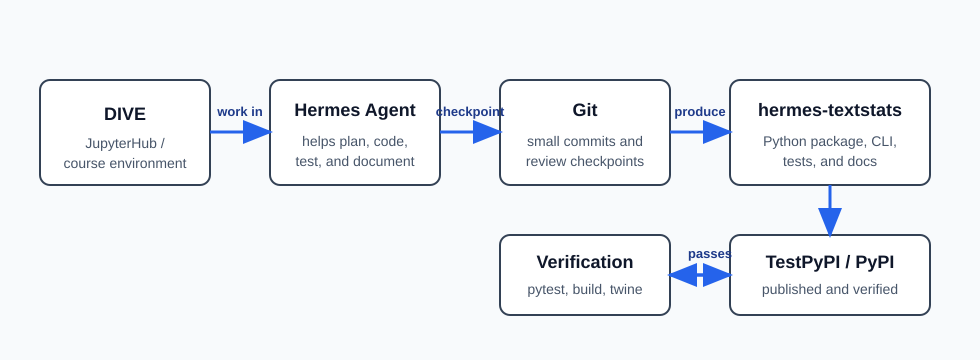

# Paper Package Summary

## One-line Summary

`hermes-textstats` is a DIVE-ready Python package that turns short text into
clear statistics from Python, the terminal, or a notebook.

## Motivation and Use Cases

I built this package as a concrete example of using Hermes Agent with git to
create a Python package that can be tested, documented, and published. The use
case is simple on purpose but easy to explain: a student working in
DIVE/JupyterHub can paste a short paragraph from an assignment, quiz
explanation, README file, or reflection and immediately see word count, sentence
count, character count, average word length, and estimated reading time. This
gives the grant/paper a concrete student output, not only a description of an
agent workflow.

## Achievements

- Published `hermes-textstats` version `0.1.0` on real PyPI.
- Verified clean install from PyPI.
- Verified both Python import and command-line usage.
- Added tests, user guide, developer guide, DIVE verification notes, paper
  notes, notebook demo, CLI screencap, and workflow diagram.

## Package Name

The name `hermes-textstats` keeps credit to Hermes because the package was built
through the Hermes Agent workflow. The `textstats` part says what the package
does directly, so a user can understand the purpose before opening the code.

## Demo Evidence

- CLI demo transcript: `docs/assets/hermes-textstats-demo.txt`
- Compact showcase screencap: `docs/assets/hermes-textstats-showcase.png`
- CLI screencap-style image: `docs/assets/hermes-textstats-demo.png`
- Workflow diagram: `docs/assets/hermes-textstats-workflow.svg`
- Notebook demo: `notebooks/demo.ipynb`

## Visuals

## Current Status

The package is published on real PyPI as version `0.1.0`:

https://pypi.org/project/hermes-textstats/0.1.0/

Before publishing, the package passed local tests, built into wheel and source
distribution files, and passed `twine check`. After publishing, I verified a
clean install from PyPI and confirmed that both Python import and the
`hermes-textstats` command-line interface work.
